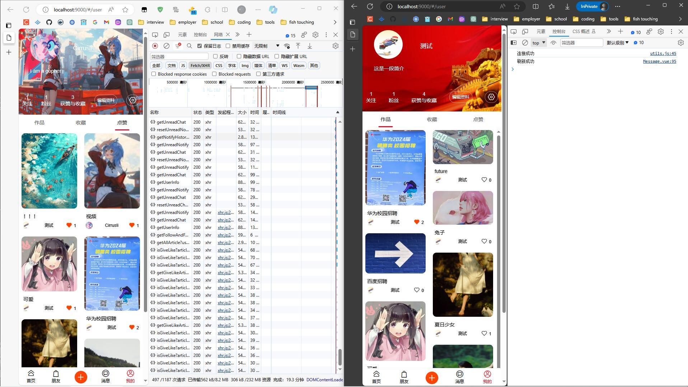
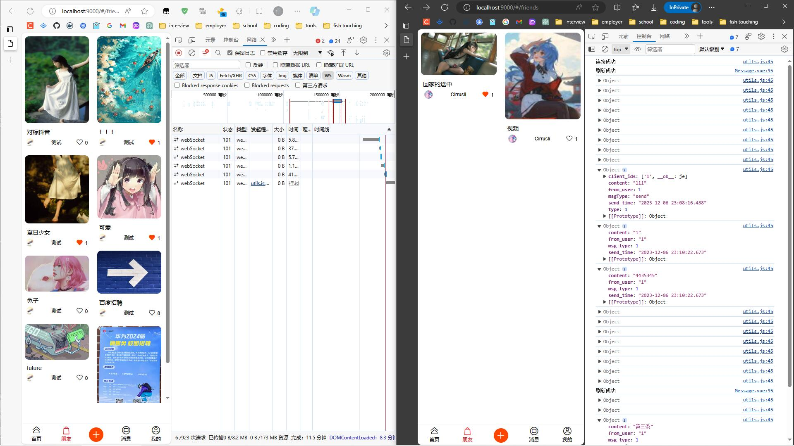
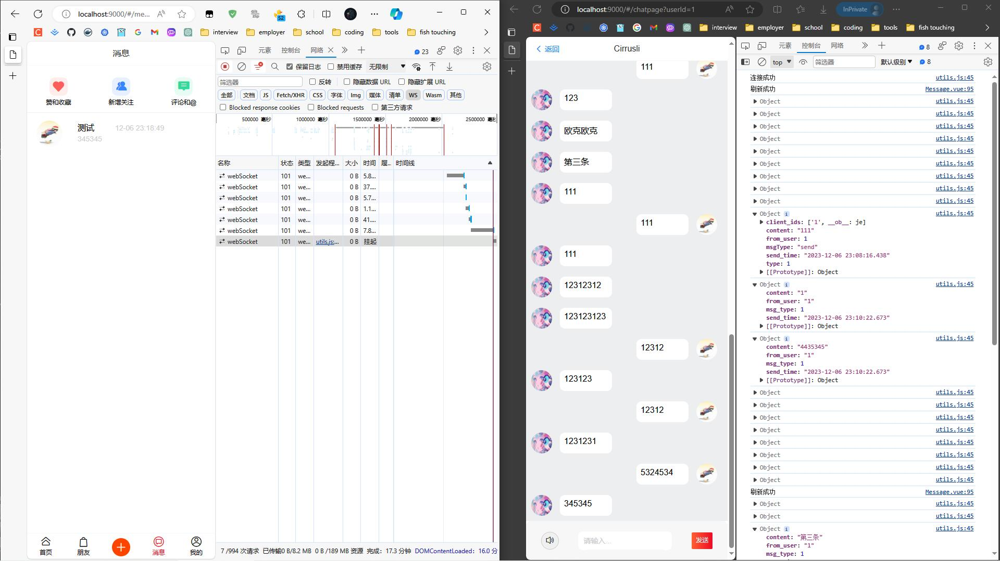
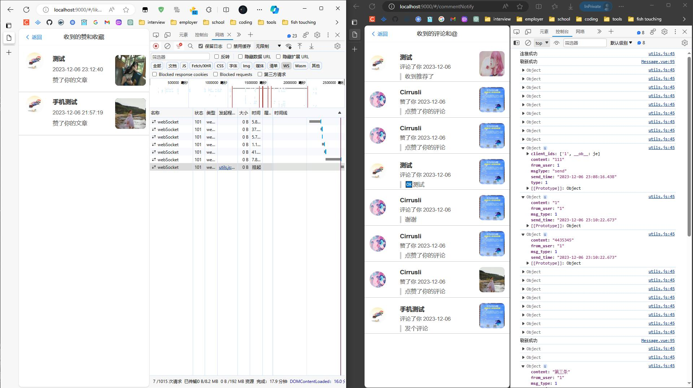

# X_UGC

一个简单的UGC平台.

## 技术选型

Gin,GORM,MySQL,Redis,RabbitMQ

## 项目结构

```
├─assets
├─biz
│  ├─dal
│  │  ├─mysql
│  │  ├─rabbitmq
│  │  └─redis
│  ├─handler
│  ├─model
│  ├─mw
│  ├─router
│  └─service
├─cmd
├─conf
├─pkg
│  ├─common
│  │  ├─bloomfilter
│  │  ├─email
│  │  ├─ffmpeg
│  │  ├─jwt
│  │  └─pwd
│  └─websocket
```

## 功能展示







